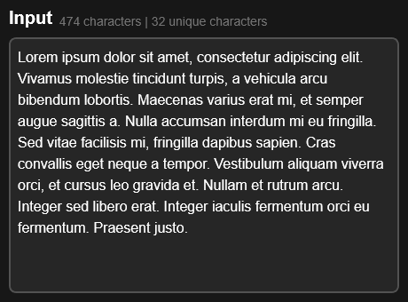
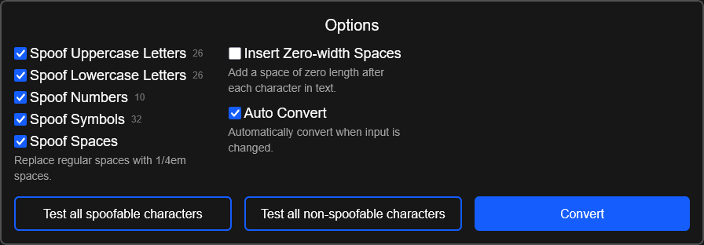
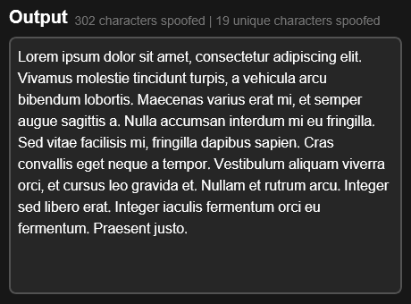
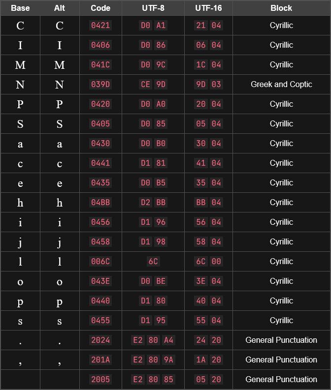

[](LICENSE)
[](https://unicode-spoofer.vercel.app/)

# Unicode Spoofer

A tool that replaces Latin characters with visually similar Unicode alternatives from other scripts (like Cyrillic or Greek). Designed to potentially bypass text detection systems while maintaining human readability.

**Example:**  
`unicode` → `unісоdе` (notice the Cyrillic 'i', 'c', 'o', and 'e')

> ⚠️ **Disclaimer:**
>
> This tool is intended for **educational and research purposes only**. Do **not** use it for malicious, deceptive, or unethical purposes.  
> The developer is **not responsible for any misuse**. Use at your own risk.

---

## 🚀 Features

- ✅ **Character Substitution** – Replaces characters while preserving readability
- ✅ **Extensible Database** – Easily add new homoglyph mappings
- ✅ **Customizable Converter** – Configure:
    - Which categories of characters to spoof (e.g. uppercase/lowercase letters, numbers, symbols, spaces)
    - Whether to insert zero-width spaces between characters
- ✅ **Live Conversion Stats** – Shows number of unique and total characters spoofed
- ✅ **Developer-Friendly** – TypeScript support and a clean, modular structure

---

## 🛠️ Usage

1. **Paste your text** into the input box  
   

2. **Configure your converter**  
   Choose which character categories to spoof and optionally insert zero-width spaces.  
   

3. **Copy the output**  
   Copy the spoofed result with your selected substitutions. See the number of spoofed characters (unique and total displayed above the output.  
   

4. **View conversion stats**  
   A table below the options shows the substituted characters:  
   

---

## 🧱 Character Database Structure

Substitution rules follow this format:

<!-- prettier-ignore -->
```typescript
interface CharacterMapping {
    base: string;   // Original Latin character (e.g., "A")
    alt: string;    // Unicode homoglyph (e.g., "А")
    block: string;  // Unicode block name (e.g., "Cyrillic")
}
```

---

## 🤝 Contributing

Contributions are welcome!  
See [CONTRIBUTING.md](CONTRIBUTING.md) for guidelines and how to get started.
